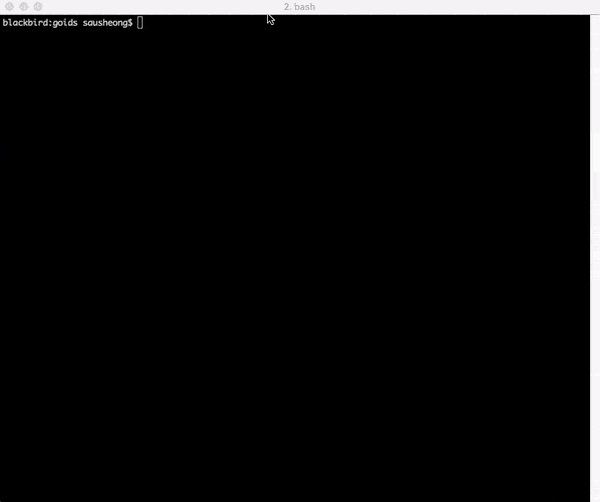

# Flocking with Go

I have been writing flocking simulations for a long time. I played around with it with Java but the earliest one I still have record of was with JRuby and Swing called [Utopia](https://youtu.be/x44s8TTWm5E). I subsequently wrote one using [Shoes](http://shoesrb.com) and that was the one in my [_Exploring Everyday Things witn R and Ruby_](http://shop.oreilly.com/product/0636920022626.do) book. Some time after (I was unhappy with Shoes in general), I re-wrote it again using [Gosu](https://github.com/gosu/gosu), a 2D game development library for Ruby and C++. This version can be found [here](https://github.com/sausheong/utopia).

[Flocking](https://en.wikipedia.org/wiki/Flocking_(behavior)) simulations are basically a software program that simulates the flocking behavior of birds. This flocking behavior is very somewhat similar to the swarming behavior of insects or the shoaling behavior of fish. It's considered an emergent behavior -- a behavior that arises from individuals following simple rules and doesn't involve any central coordination. Such behavior, especially seen in murmurations of starlings or swarms of barracuda can be a breath-taking phenomenon.


## Boids

Flocking was first simulated in software by Craig Reynolds, a programmer who developed a software program called [_boids_](http://www.red3d.com/cwr/boids/) and published a paper on the topic in 1987 in the proceedings of the ACM SIGGRAPH conference. Since then, there has been a number of advancements in simulating flocking but nonetheless the basic idea still remains pretty simple.

Boids itself used three basic rules to describe how an individual boid moves around:

* _Separation_ -- avoid crowding other flockmates that are close by 
* _Alignment_ -- move towards the average direction of nearby flockmates
* _Cohesion_ -- move towards the average position of nearby flockmates


These rules have been expanded and in some cases, more rules have been added but the fundamental idea is that a localised reaction by an individual following a few simple rules can result in complex, unexpected behavior.

## Doing it in Go

While I have been programming in Go seriously for a few years (it's my primary programming language now), I haven't been able to figure out a good way to write a flocking simulation with Go all this time. The biggest problem is that Go is mostly a backend programming language and doesn't really have a GUI toolkit. While there were a few attempts, including bindings to GTK and QT, none of them fit what I wanted. If you're looking for one for a desktop application, you are probably better off using [Electron](https://github.com/electron/electron) and building a web application in Go to back that up.

That is, until I was fiddling around with genetic algorithms in my post [_A gentle introduction to genetic algorithms_](https://sausheong.github.io/posts/a-gentle-introduction-to-genetic-algorithms/). In that post I was trying to display an image to the terminal, in my case, the excellent [iTerm2](https://www.iterm2.com/). There's where I stumbled on this hack on iTerm2 that allows me to display images on the screen.

Naturally if I can display one image, I can always display multiple images. And if I can display multiple images, I can also display them overlaying each other, one after another. And if I can display them fast enough ...


## Goids

I call them _goids_, of course. A `Goid` is a simple struct with information on its position, velocity and color. 

```go
type Goid struct {
	X     int // position
	Y     int
	Vx    int // velocity
	Vy    int
	R     int // radius
	Color color.Color
}
```

Position and color is pretty easy to understand. Velocity here is not simply the speed the goid is moving but also direction it is moving. In this case, `Vx` and `Vy` is how far away the goid is going to be away the next loop, and also directionally where it's going to be. Mathematically speaking, while `X` and `Y` is the _scalar_ position (it tells you how far away from origin on a 2D plane), `Vx` and `Vy` is a [_vector_](http://mathinsight.org/vector_introduction).

Creating goids is relatively simple. Each goid must be within the window and its starting velocity is smaller than its size.

```go
func createRandomGoid() (g Goid) {
	g = Goid{
		X:     rand.Intn(windowWidth),
		Y:     rand.Intn(windowHeight),
		Vx:    rand.Intn(goidSize),
		Vy:    rand.Intn(goidSize),
		R:     goidSize,
		Color: goidColor,
	}
	return
}
```

The bulk of the work is in the `move` function.

```go
// move the goids with the 3 classic boid rules
func move(goids []*Goid) {
	for _, goid := range goids {
		neighbours := goid.nearestNeighbours(goids)
		separate(goid, neighbours)		
		align(goid, neighbours)
        cohere(goid, neighbours)

		stayInWindow(goid)
	}
}
```

Flocking simulations have advanced considerably since 30 years ago, but for this simple simulation I used the 3 classic rules from boids. All 3 rules require the goid to know who its neighbours are so it makes sense to figure that out first.

```go
// find the nearest neighbours
func (g *Goid) nearestNeighbours(goids []*Goid) (neighbours []Goid) {
	neighbours = make([]Goid, len(goids))
	for _, goid := range goids {
		neighbours = append(neighbours, *goid)
	}
	sort.SliceStable(neighbours, func(i, j int) bool {
		return g.distance(neighbours[i]) < g.distance(neighbours[j])
	})
	return
}

// distance between 2 goids
func (g *Goid) distance(n Goid) float64 {
	x := g.X - n.X
	y := g.Y - n.Y
	return math.Sqrt(float64(x*x + y*y))

}
```

First, we clone the entire population of goids, then we use `sort.SliceStable` to sort the cloned array by distance from the goid in question. Finding the distance is just a matter of using the Pythagoras theorem.


This gives us a list of neighbouring goids, sorted by distances away. Let's look at the first rule.

### Separation rule

This is the _personal space_ rule. Let's say you're in a train with a number of other commuters, and it stops at a station where there are a number of people getting in. As they come in, they will fill up the space, and there will be some who end up too close to you. What would you do? You're going to move a bit away from them but not too close to others, and finally settling down to a comfortable distance from everyone else. This is that rule.

```go
// steer to avoid crowding local goids
func separate(g *Goid, neighbours []Goid) {
	x, y := 0, 0
	for _, n := range neighbours[0:numNeighbours] {
		if g.distance(n) < separationFactor {
			x += g.X - n.X
			y += g.Y - n.Y
		}
	}
	g.Vx = x
	g.Vy = y
	g.X += x
	g.Y += y
}
```

We're only interested in a limited number of neighbouring goids, which is specified by the parameter `numNeighbours`. The neighbouring goids must also be within the parameter `separationFactor` (not all neighbouring goids are close enough for it to be uncomfortable). Once these goids are in that space, we move a bit away from each one of them. Then we update the velocity to that distance away, and then move the goid by that velocity.


### Alignment rule

This is the _peer pressure_ rule. Peer pressure is direct influence on people by their peers to change their behaviour to conform to their of the group. You might be familiar with peer pressure -- when you see your neighbours with their shiny new 4K TV or iPhone X you might be tempted to get one for yourself as well. There are plenty of other examples of peer pressure in our lives that it doesn't need further explanation, and this is exactly what the alignment rule is.


```go
// steer towards the average heading of local goids
func align(g *Goid, neighbours []Goid) {
	x, y := 0, 0
	for _, n := range neighbours[0:numNeighbours] {
		x += n.Vx
		y += n.Vy
	}
	dx, dy := x/numNeighbours, y/numNeighbours
	g.Vx += dx
	g.Vy += dy
	g.X += dx
	g.Y += dy
}
```

As before, we are only interested in a limited number of neighbouring goids specified by `numNeighbours`. However instead of affecting the position of the goid, this rule changes the velocity of the goid and we add up the velocity of all the neighbouring goids, and divide it by the number of neighbours. The final value modifies the velocity instead of replacing it altogether, while the position of the goid is modified by the new value.

### Cohesion rule

This is the _phalanx_ rule. The Greek phalanx was a rectangular, close-rank infantry formation that marched and fought as one entity. It was one of the most effective and enduring military formation in ancient warfare. Its effectiveness lie in the tight formation of impenetrable shields and spears that slowly advanced forward, breaking through enemy ranks. The Romans later took the same idea to create the three-line Roman legion that was used to conquer the known world.


```go
// steer to move toward the average position of local goids
func cohere(g *Goid, neighbours []Goid) {
	x, y := 0, 0
	for _, n := range neighbours[0:numNeighbours] {
		x += n.X
		y += n.Y
	}
	dx, dy := ((x/numNeighbours)-g.X)/coherenceFactor, ((y/numNeighbours)-g.Y)/coherenceFactor
	g.Vx += dx
	g.Vy += dy
	g.X += dx
	g.Y += dy
}
```

As with the other rules, we are only interested in the neighbouring goids. We take the average position of all these neighbours (adding up the positions of all the neighbours and dividing it by the number of neighbours), and subtract the goid's position from it. This value is then divided by a `coherenceFactor` that determines how much the goids want to cohere with its neighbours. If the `coherenceFactor` is too high, the goids will end up not moving, if it's too low it will end up sticking too closely with each other, forming clusters of tightly-knit goids. 

### Staying within view

Now that we have the rules we can run simulation, but since our view is limited to the parameters `windowWidth` and `windowHeight`, once the goids wander off the screen we can't see it anymore. Which means after a while, it's just an empty screen. To stop that from happening, if a goid wanders off the screen, we magically transport it to the other side of the window.

```go
// if goid goes out of the window frame it comes back on the other side
func stayInWindow(goid *Goid) {
	if goid.X < 0 {
		goid.X = windowWidth + goid.X
	} else if goid.X > windowWidth {
		goid.X = windowWidth - goid.X
	}
	if goid.Y < 0 {
		goid.Y = windowHeight + goid.Y
	} else if goid.Y > windowHeight {
		goid.Y = windowHeight - goid.Y
	}
}
```

### Showing the frame

The final piece of the puzzle is drawing the goids themselves. 

```go
// draw the goids
func draw(goids []*Goid) *image.RGBA {
	dest := image.NewRGBA(image.Rect(0, 0, windowWidth, windowHeight))
	gc := draw2dimg.NewGraphicContext(dest)
	for _, goid := range goids {
		gc.SetFillColor(goid.Color)
		gc.MoveTo(float64(goid.X), float64(goid.Y))
		gc.ArcTo(float64(goid.X), float64(goid.Y), float64(goid.R), float64(goid.R), 0, -math.Pi*2)
		gc.LineTo(float64(goid.X-goid.Vx), float64(goid.Y-goid.Vy))
		gc.Close()
		gc.Fill()
	}
	return dest
}
```

Each frame is an image of width `windowWidth` and height `windowHeight`. WIthin this frame, we draw each goid as a circle, and then we draw a line to represent the goid's tail. This line goes against the direction of where the goid is going, so we subtract the position of the goid from its velocity.

### Displaying the simulation

We have all the functions needed now, so let's put it all together in the `main` function.

```go
func main() {
	clearScreen()
	hideCursor()

	goids := make([]*Goid, 0)
	for i := 0; i < populationSize; i++ {
		g := createRandomGoid()
		goids = append(goids, &g)
	}

	for i := 0; i < loops; i++ {
		move(goids)
		frame := draw(goids)
		printImage(frame.SubImage(frame.Rect))
		fmt.Printf("\nLoop: %d", i)

	}
	showCursor()
}
```

There are a few more functions that you're not seen before. What are `clearScreen`, `hideCursor`, `showCursor` and `printImage`? These are the functions that actually display the simulation.

Let's look at `clearScreen`, `hideCursor` and `showCursor`.

```go
func hideCursor() {
	fmt.Print("\x1b[?25l")
}

func showCursor() {
	fmt.Print("\x1b[?25h\n")
}

func clearScreen() {
	fmt.Print("\x1b[2J")
}
```

So what's the strange escape sequences we used? These are [ANSI escape sequences](https://en.wikipedia.org/wiki/ANSI_escape_code) used to control the various options on text terminals. They are mostly a relic of the past but still widely implemented in terminal emulators such as iTerm2. All sequences start with `ESC` (27 or in hex 0x1B), followed by a second byte that provides the control option. In particular, `ESC` followed by `[` indicates that the next byte is a Control Sequence Introducer (CSI), which is a set of useful sequences. For example, `?25h` shows the cursor and `?25l` hides the cursor. And as you would have probably guessed, `2J` clears the entire screen and moves the cursor to the upper left of the screen.

Let's look at how we print the image to the screen.

```go
// this only works for iTerm!
func printImage(img image.Image) {
	var buf bytes.Buffer
	png.Encode(&buf, img)
	imgBase64Str := base64.StdEncoding.EncodeToString(buf.Bytes())
	fmt.Printf("\x1b[2;0H\x1b]1337;File=inline=1:%s\a", imgBase64Str)
}
```

This is an interesting hack that is only found (as far as I know) in [iTerm2](https://www.iterm2.com/documentation-images.html). that allows you to take the base64 representation of a binary image and prints it inline on the terminal. The escape sequence `2;0H` at the start of the line is a CSI that moves the cursor to row 2, column 0, where we want to print the image.


## Final simulation

This is how it looks when I run it.




## Code

All the code found here can get found at http://github.com/sausheong/goids.

## Why did I do this?

Flocking simulations have been done to the death, but I enjoy writing it. I guess that's probably why I did it for the I-don't-know-how-many-times. Also, it gives me ideas and practice on where else to take it, and also doing more with the idea of printing frames on a terminal. You'll probably see more of this later.